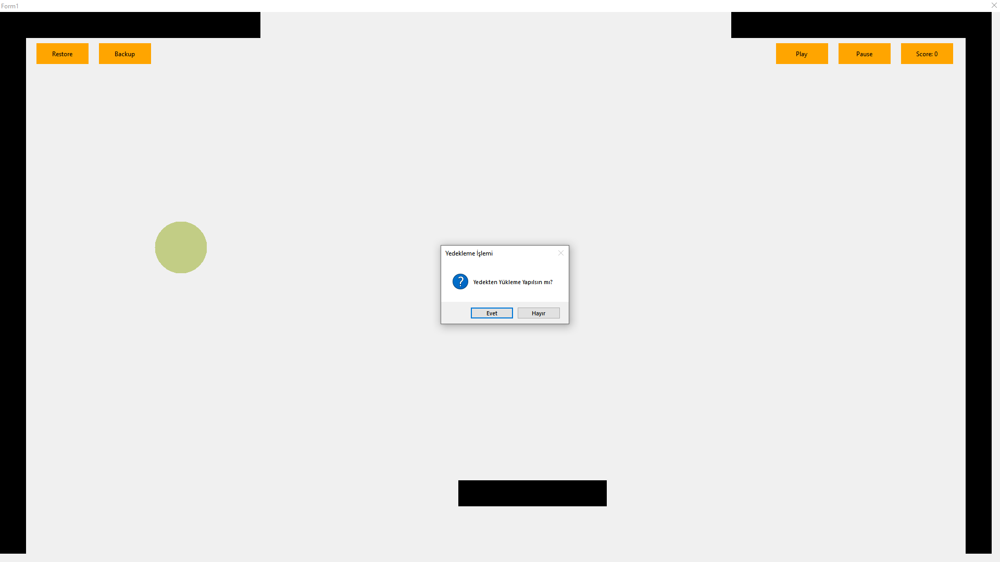
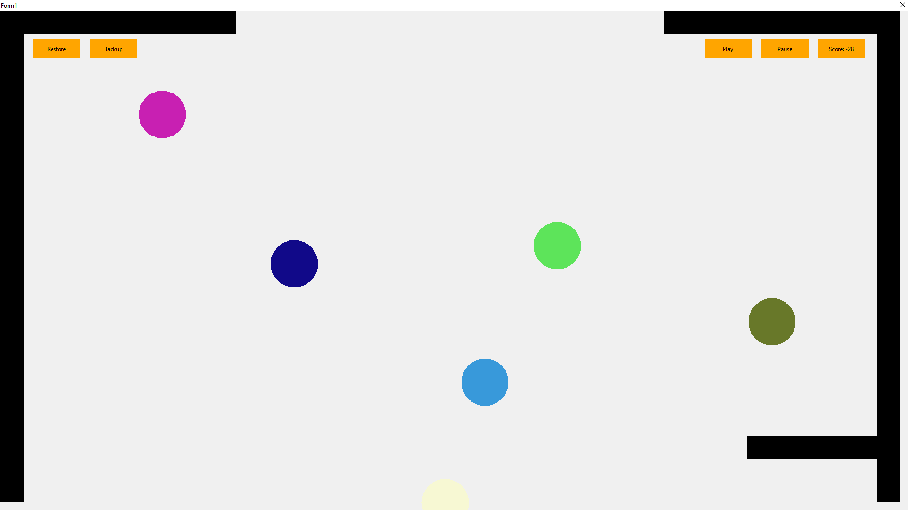
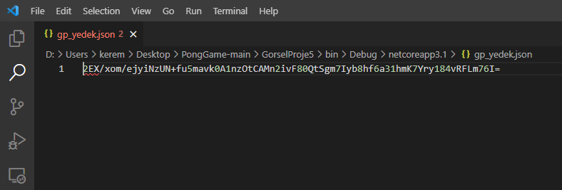

# Pong Game 🏓 

Pong, gelen topları belirli bir alana göndermeniz gereken ve yasaklı alanlara gitmesini önmlemeye çalıştığınız bir oyun.

# Nasıl Oynanır?

`⬅️  ➡️`: Yön tuşları ile barı kontrol et.  

# Oyun Görüntüleri

   

# Oyun Özellikleri 

<ul>
  <li>Pause ve Play butonları ile oyunu durdurma ve devam ettirme.</li>
  <li>JSON formatındaki dosyaya, şifrelenmiş şekilde top konumlarını kaydederek yedek ve yedekten geri yükleme işlemleri yapma.</li>
</ul>

# Kullanılan Teknolojiler

<ul>
  <li>C#</li>
  <li>VS</li>
</ul>

# İletişim

`Kerem Ersu` => [LinkedIn](https://www.linkedin.com/in/kerem-ersu-0082ba194/)
